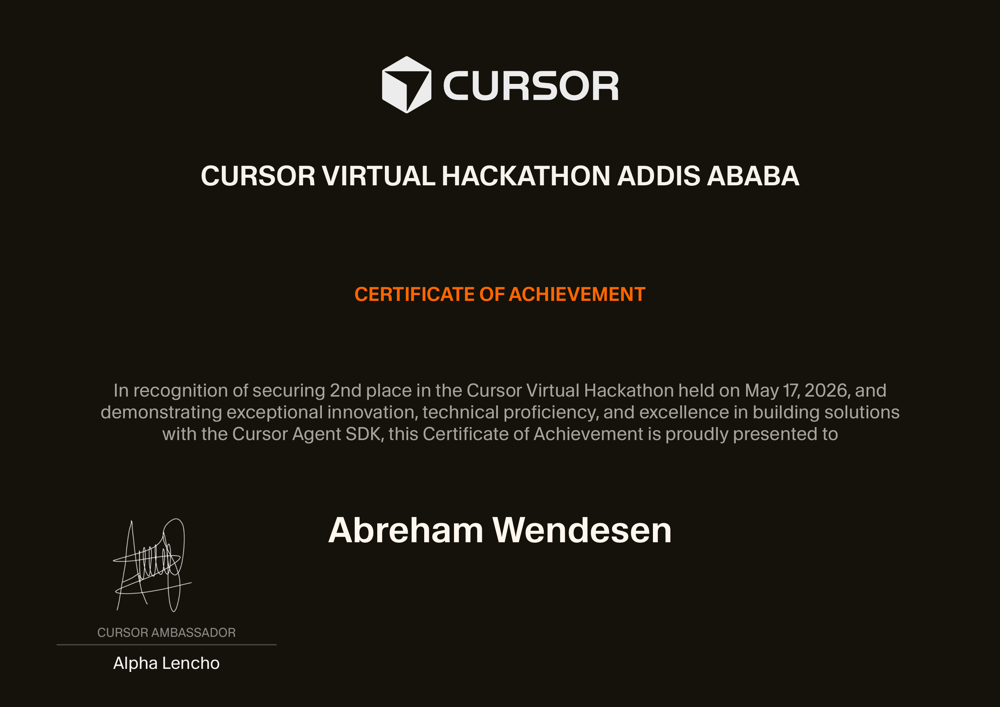

  
  
  
  

  

<!-- LeetCode Heatmap -->
<table width="100%">
  <tr>
    <td align="center">
      <table width="100%">
        <tr>
          <td align="center" bgcolor="#f9c440">
            <strong>⚡ LEETCODE CONSISTENCY — FULL ACTIVITY HEATMAP ⚡</strong>
          </td>
        </tr>
        <tr>
          <td align="center" bgcolor="#161b22">
             
            
              
          </td>
        </tr>
      </table>
    </td>
  </tr>
</table>

 

## ⚡ About Me

> *“Write code that lasts — scalable, maintainable, and meaningful.”*

 

<table>
  <tr>
    <td width="60%" valign="top">
      <h3>👨‍💻 The Developer</h3>
      <ul>
        <li>👋 I'm <strong>Abrham</strong> (<strong>abrshiz</strong>), a developer from <strong>Addis Ababa, Ethiopia 🇪🇹</strong>.</li>
        <li>🎓 <strong>Computer Science Student</strong> — passionate about backend architecture & system design.</li>
        <li>☕ <strong>Java Specialist</strong> — building robust, scalable applications with clean architecture.</li>
        <li>🔭 Currently working on: <strong>Enterprise-level Java applications & full-stack solutions</strong>.</li>
        <li>🌱 Learning: <strong>Microservices Architecture, Spring Boot, Cloud Deployment</strong>.</li>
        <li>⚡ Fun fact: I reduced query response time by <strong>40%</strong> through database optimization and indexing strategies.</li>
      </ul>
    </td>
    <td width="40%" valign="center" align="center">
      
    </td>
  </tr>
</table>

  

## 🛠️ Tech Arsenal

| ☕ **Languages** | 🎨 **Frontend** | ⚙️ **Backend** |
| :---: | :---: | :---: |
|  |  |  |

| 🗄️ **Databases** | 🧰 **Dev Tools** | 🚀 **Deployment** |
| :---: | :---: | :---: |
|  |  |  |

  

## 💼 Experience & Focus Areas

| 🏢 **Domain** | 🎯 **Expertise** | 🚀 **Achievements** |
| :---: | :---: | :---: |
| **Java Development** | OOP, Design Patterns, Multithreading | Built 5+ production-ready Java applications |
| **Database Systems** | MySQL Optimization, Schema Design | 40% faster queries through indexing strategies |
| **Full-Stack Apps** | REST APIs, Client-Server Architecture | Complete solutions from backend to frontend |
| **System Architecture** | Clean Code, SOLID Principles | Scalable, maintainable codebases |

  

## 🚀 Featured Projects

| 🌟 **Project** | 🧾 **Description** | 🧠 **Stack** |
| :--- | :--- | :--- |
| 📋 **TaskFlow Manager** | Comprehensive task management with user auth, deadlines, and categories. | `Java` • `MySQL` • `OOP` • `SOLID` |
| 💬 **Real-time ChatVerse** | Multi-client chat system with real-time messaging & history. | `Java` • `Sockets` • `Multithreading` • `MySQL` |
| 🏥 **MediCare HMS** | Complete hospital management with patient records, billing & appointments. | `Java` • `Swing` • `MySQL` • `JDBC` |

  

## 🎓 Education & Certifications

<table>
  <tr>
    <td>🎓 <strong>B.Sc. in Computer Science</strong> — Dire Dawa University (In Progress)</td>
  </tr>
  <tr>
    <td>☕ <strong>Oracle Certified Associate, Java SE</strong> — In Progress</td>
  </tr>
  <tr>
    <td>📊 <strong>Data Structures & Algorithms</strong> — Advanced Problem Solving</td>
  </tr>
  <tr>
    <td>🖥️ <strong>Full-Stack Web Development</strong> — Self-taught & Project-Based</td>
  </tr>
  <tr>
    <td>💡 <strong>Database Design & Optimization</strong> — MySQL Certified</td>
  </tr>
</table>

  

## 🏆 Achievements

  

  

## ⚡ Live Stats Dashboard

  

  

<table>
  <tr>
    <td align="center">
      
    </td>
    <td align="center">
      
    </td>
  </tr>
</table>

  

## 📈 Contribution Graph

  

  

## 🧠 Coding Philosophy

> *“Great software is built on solid foundations — clean code, thoughtful architecture, and relentless optimization.”*

I believe in writing code that's not just functional but **elegant** and **maintainable**.  
Every project is an opportunity to craft something that solves real problems and stands the test of time.

  

## 🤝 Let's Connect

Building something awesome? Let's collaborate and create impact together.

  

  

  

